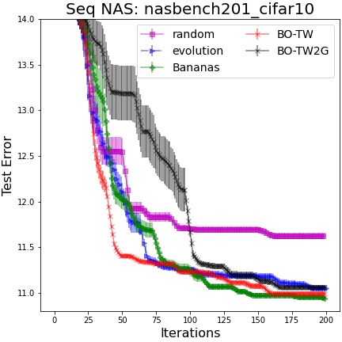
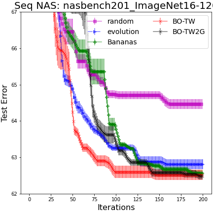

<div align="center">

# Optimal Transport Kernels for Sequential and Parallel Neural Architecture Search


[](https://arxiv.org/abs/2006.07593)
[](https://icml.cc/Conferences/2021/ScheduleMultitrack?event=9843)
</div>


# Requirements
- tensorflow == 1.14.0
- pytorch == 1.2.0, torchvision == 0.4.0
- pot == 0.7 https://pythonot.github.io/# 
- cyDPP (already included in the package)
- matplotlib, jupyter
- nasbench101 (follow the installation instructions [here](https://github.com/google-research/nasbench))
- nasbench201 (follow the installation instructions [here](https://github.com/D-X-Y/NAS-Bench-201))

# Dataset
To run on NASBench101, download `nasbench_only108.tfrecord` from [here](https://github.com/google-research/nasbench) and place it in the top level folder of this repo.
To run on NASBench201, download `NAS-Bench-201-v1_1-096897.pth` from [here](https://github.com/D-X-Y/NAS-Bench-201) and place it in the top level folder of this repo.

# Sequential NAS on the NASBench search space

To customize your experiment (select algorithm and number of iteration including number of initial observations), open `params.py` and edit the `algo_params_seq`. Here, you can change the hyperparameters and the algorithms to run.

```
python run_experiments/run_experiments_sequential.py
python run_experiments_sequential.py --search_space nasbench
python run_experiments_sequential.py --search_space nasbench201_cifar10
python run_experiments_sequential.py --search_space nasbench201_cifar100
python run_experiments_sequential.py --search_space nasbench201_ImageNet16-120
```

This will run the sequential NAS setting including the BO algorithm against several other sequential NAS algorithms on the NASBench101 search space.

# Batch NAS on the NASBench search space

To customize your experiment (select algorithm and number of iteration including number of initial observations), open `params.py` and edit the `algo_params_batch`. Here, you can change the hyperparameters and the algorithms to run.

```
python run_experiments/run_experiments_batch.py
python run_experiments_batch.py --search_space nasbench
python run_experiments_batch.py --search_space nasbench201_cifar10
python run_experiments_batch.py --search_space nasbench201_cifar100
python run_experiments_batch.py --search_space nasbench201_ImageNet16-120
```
This will run the batch NAS setting including the k-DPP quality algorithm against several other batch baseline algorithms on the NASBench201 search space.

We adapt the source code from BANANAS to enable the fair comparison with BANANAS and other baselines https://github.com/naszilla/bananas

# Plot the result for comparison
```
python plot_result_sequential.py
python plot_result_batch.py
```

Examples of the results over 5 independent runs.

## Parallel NAS

 

 

## Sequential NAS
  


# Reference
```
Vu Nguyen*, Tam Le*, Makoto Yamada, Michael A. Osborne.  "Optimal Transport Kernels for Sequential and Parallel Neural Architecture Search." International Conference on Machine Learning (ICML), 2021.
```


```
@inproceedings{nguyen2021optimal,
  title={Optimal transport kernels for sequential and parallel neural architecture search},
  author={Nguyen, Vu and Le, Tam and Yamada, Makoto and Osborne, Michael A},
  booktitle={International Conference on Machine Learning},
  pages={8084--8095},
  year={2021},
  organization={PMLR}
}
```


